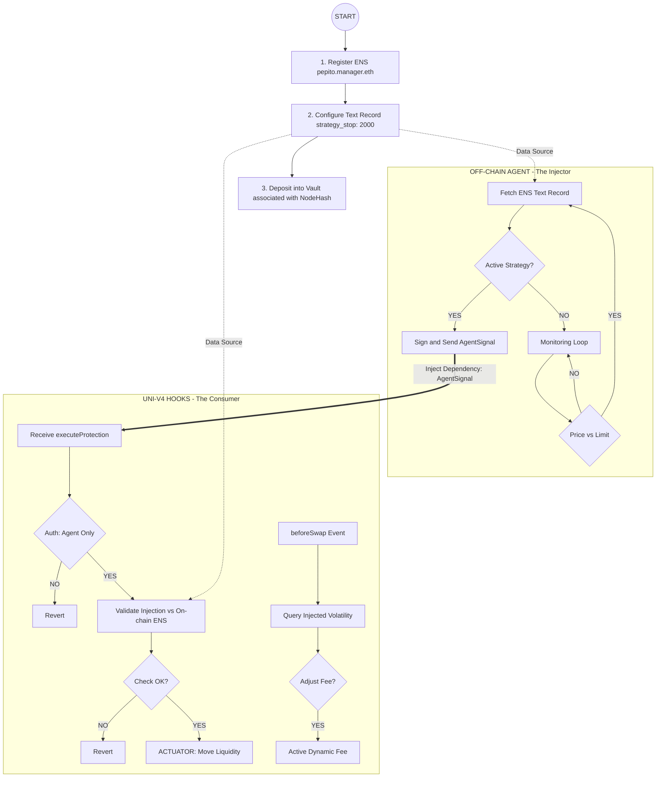

# ENStable

> **Our team is developing a Uniswap v4 Hook that audits liquidity based on your ENS risk profile.**

The idea has become much more concrete as we focus on **Unichain L2**. We are integrating **ENS L2 Primary Names** to define position ownership, ensuring a decentralized identity layer for our agentic vault. We are now working at full speed to meet the submission deadline and are confident in delivering a functional MVP that showcases a truly simple and secure vault controlled by an intelligent off-chain agent.

---

## 📑 Overview

**ENStable** bridges the gap between complex DeFi yield strategies and decentralized identity. By using ENS Text Records as a "Remote Control," users can define their risk tolerance on-chain, which our AI-Agent and Uniswap v4 Hook respect to manage liquidity automatically.

### Key Pillars

- **Identity-Driven:** Your liquidity is tied to your `pepito.manager.eth` (or any Unichain ENS Primary Name).
- **Agentic Automation:** An off-chain Python agent acts as a dependency injector, signaling the vault when market conditions meet the user's ENS-defined strategy.
- **Unichain Native:** Optimized for the Unichain L2 ecosystem, utilizing low-cost transactions for frequent rebalancing and ENS resolution.

---

## ⚙️ How it Works (The Flow)

The following diagram illustrates the lifecycle of a position, from ENS registration to AI-triggered rebalancing:

## 🛠️ Technical Implementation

### 1. IdentityVault (L2 Custodian)

The "stubborn" vault that holds the funds. It validates that the `AgentSignal` matches the user's intent.

- **Sovereign Withdrawals:** Users can bypass the agent and withdraw their ETH/USDC at any time.
- **Solvency Guard:** Internal checks with 2-wei tolerance to ensure zero debt with the `PoolManager`.

### 2. The Hook (The Actuator)

A custom Uniswap v4 Hook that performs:

- **Dynamic Fee Adjustment:** Based on injected volatility data from the agent.
- **On-chain Validation:** It queries the ENS L2 Primary Name to ensure the transaction signer is authorized by the position owner.

### 3. Off-Chain Agent (The Brain)

A Python-based agent that monitors Unichain market data.

- Reads **ENS Text Records** (e.g., `strategy_stop`) to customize the protection for each individual user.
- Injects signed signals into the Hook to trigger liquidity movements.

---

## 🏗️ Stack

- **Network:** Unichain L2
- **Identity:** ENS (L2 Reverse Registrars)
- **DEX:** Uniswap v4 (Hooks & PoolManager)
- **Language:** Solidity (Foundry) & Python (Agent)

---

## 🔒 Security

- **Global Slippage Cap:** Hardcoded 3% limit to prevent toxic flow or agent manipulation.
- **Whitelisted Execution:** Only the designated AI Wallet can signal rebalances, while only the User can withdraw funds.
